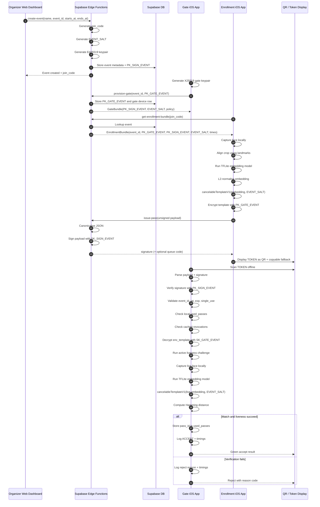

# ARCHITECTURE.md

## One-Time Face Pass — System Architecture

## 1. Purpose

This document defines the technical architecture for **One-Time Face Pass**, a privacy-preserving event entry system designed to prove that biometric verification can be implemented without storing raw face images or reusable biometric embeddings. The architecture is derived strictly from the locked constraints in the truth base and aligned with the previously defined PRD.

The architecture has four principal goals:

1. preserve biometric privacy by ensuring that face data is processed only on-device and transformed into a cancelable event-scoped template,
2. ensure that stolen QR tokens are not sufficient to reveal usable biometric material,
3. enable full gate verification while offline,
4. enforce one gate device per event and one successful use per pass.

---

## 2. System Overview

One-Time Face Pass is a three-application system supported by a shared package and a Supabase backend.

### 2.1 Core Components

#### A. Organizer Web Dashboard
The web dashboard is the administrative control plane. It is responsible for:
- organizer authentication,
- event creation,
- viewing join codes,
- monitoring gate provisioning state,
- managing revocations,
- optionally reviewing uploaded gate logs.

The dashboard does **not** perform biometric processing and does **not** handle private biometric material.

#### B. Enrollment iOS App
The enrollment app runs on the attendee’s iPhone before the event. It is responsible for:
- obtaining the public enrollment bundle using the join code,
- collecting consent,
- capturing the attendee’s face,
- running the on-device TFLite embedding model,
- transforming the embedding into a cancelable 256-bit event-scoped template,
- encrypting that template to the gate’s public key,
- requesting server signature over the pass payload,
- displaying the final signed QR token.

This app is the only place where the attendee’s live biometric is initially processed, and it must not persist raw images or embeddings.

#### C. Gate Verifier iOS App
The gate verifier is the operational enforcement point. It is responsible for:
- generating the gate encryption keypair,
- storing the gate private key securely on-device,
- downloading policy and revocation state before the event,
- scanning or manually receiving the token,
- verifying signature offline,
- decrypting the protected template offline,
- running active liveness,
- generating a fresh live template,
- performing Hamming-distance comparison,
- rejecting replays,
- logging only non-biometric telemetry.

This app is the only component that can decrypt the encrypted template carried inside the token.

#### D. Shared Package
The shared package centralises deterministic logic used across all components:
- canonical JSON encoding,
- base64url encoding helpers,
- sodium initialisation wrappers,
- cancelableTemplateV1,
- Hamming distance calculation,
- shared types and reason codes,
- timing utilities.

#### E. Supabase Backend
The backend provides:
- relational storage for events, gate devices, revocations, and uploaded logs,
- Edge Functions for event creation, gate provisioning, enrollment bundle retrieval, pass signing, gate sync, revocation, and optional log upload,
- authenticated organizer access control.

The backend is trusted for event administration and signature issuance, but it is deliberately excluded from the live gate verification loop.

---

## 3. Monorepo Structure

The monorepo must follow the locked structure below.

```text
face-pass/
  apps/
    web/                      # Next.js 16 organizer dashboard
    enrollment/               # Expo iOS enrollment app
    gate/                     # Expo iOS gate verifier app
  packages/
    shared/                   # shared TS types + crypto + template utils
  supabase/
    functions/
      create-event/
      provision-gate/
      get-enrollment-bundle/
      issue-pass/
      revoke-pass/
      gate-sync/
      upload-gate-logs/
    migrations/
  docs/
    ARCHITECTURE.md
    THREAT_MODEL.md
    PRIVACY_BY_DESIGN.md
    EVALUATION_PLAN.md
    ASSUMPTIONS.md
  pnpm-workspace.yaml
  package.json
  README.md
```

### 3.1 Application Responsibilities by Directory

#### `apps/web`
Contains the Next.js 16 organizer dashboard built with **shadcn/ui** and Tailwind. Primary concern: administration and visibility, not verification.

#### `apps/enrollment`
Contains the React Native + Expo Dev Build attendee enrollment client using standard `StyleSheet` styling. Primary concern: secure on-device biometric capture and pass construction.

#### `apps/gate`
Contains the React Native + Expo Dev Build gate verifier using standard `StyleSheet` styling. Primary concern: offline verification and local security enforcement.

#### `packages/shared`
Contains the shared TypeScript logic that must remain deterministic and consistent across web, backend, and mobile.

#### `supabase/functions`
Contains all privileged server-side business logic. In particular, pass signing and event creation occur here, never on mobile.

#### `supabase/migrations`
Defines the event, gate device, revocation, and gate log tables together with RLS policies.

#### `docs`
Contains architecture, threat model, privacy rationale, assumptions, and evaluation methodology.

---

## 4. Trust Boundaries and Security Zones

The system has four major trust zones.

### Zone 1: Trusted Server Boundary
This includes Supabase Edge Functions and secure secret storage used for event signing keys and optional fallback secrets.

Trusted responsibilities:
- creating event-scoped signing keys,
- signing payloads,
- storing organizer-owned event metadata,
- storing revocation state,
- distributing public verification materials.

Not trusted for:
- storing biometrics,
- deciding live entry at the gate.

### Zone 2: Trusted Gate Boundary
This includes the gate phone, local encrypted storage, local SQLite state, and the offline verification pipeline.

Trusted responsibilities:
- holding `SK_GATE_EVENT`,
- decrypting the protected template,
- checking replay and revocation state locally,
- running liveness and matching,
- recording non-biometric logs.

### Zone 3: Semi-Trusted Enrollment Boundary
This includes the attendee device during enrollment.

Trusted responsibilities:
- capturing a face locally,
- generating the biometric embedding locally,
- converting it into a cancelable template,
- encrypting to the gate public key.

Not trusted for:
- signing a pass,
- bypassing timing or event constraints,
- modifying event policy.

### Zone 4: Untrusted Presentation / Transport Boundary
This includes:
- QR display,
- screenshots,
- copied tokens,
- network transport to public endpoints.

Because this boundary is untrusted, the design ensures:
- authenticity via Ed25519 signature,
- confidentiality of the template via X25519 sealed box encryption,
- replay prevention via local used-pass state.

---

## 5. Cryptographic Key Hierarchy

The system uses an event-scoped cryptographic hierarchy. The purpose of this hierarchy is to separate authenticity, confidentiality, and biometric unlinkability.

## 5.1 Event Root Context
Each event is defined by an `event_id` and owns its own independent trust domain. The following values are event-scoped.

### A. Server Signing Keypair
- `SK_SIGN_EVENT`: Ed25519 private signing key
- `PK_SIGN_EVENT`: Ed25519 public verification key

**Generation:** Created by the backend during event creation.

**Storage:**
- `SK_SIGN_EVENT`: stored only in secure Edge secret infrastructure; never stored in database rows and never sent to clients.
- `PK_SIGN_EVENT`: stored in the `events` table and distributed to the gate for offline signature verification.

**Purpose:** Proves that a pass payload was issued by the trusted server for the specific event.

### B. Gate Encryption Keypair
- `SK_GATE_EVENT`: X25519 private decryption key
- `PK_GATE_EVENT`: X25519 public encryption key

**Generation:** Created on the gate phone during provisioning.

**Storage:**
- `SK_GATE_EVENT`: stored only on the gate device in secure iOS storage.
- `PK_GATE_EVENT`: uploaded during provisioning and stored in the database.

**Purpose:** Ensures only the gate device can decrypt the protected biometric template inside the token.

### C. Event Salt
- `EVENT_SALT`: 32 random bytes

**Generation:** Created by the backend during event creation.

**Storage:** Stored in the `events` table and distributed to enrollment and gate apps.

**Purpose:** Produces event-scoped cancelable biometric templates. A template generated under one event salt cannot be directly reused across other events.

### D. Optional Fallback Secret
- `K_CODE_EVENT`: 32 random bytes

**Generation:** Optional generation during gate provisioning.

**Storage:** Edge secret infrastructure and gate-local policy bundle if used.

**Purpose:** Supports optional queue-code handling only. It must not be treated as a replacement for full offline token verification.

---

## 5.2 Hierarchy Summary

```text
Event (event_id)
├── Authenticity branch
│   ├── SK_SIGN_EVENT   [server secret only]
│   └── PK_SIGN_EVENT   [DB + gate verifier]
├── Confidentiality branch
│   ├── SK_GATE_EVENT   [gate secure storage only]
│   └── PK_GATE_EVENT   [DB + enrollment app]
├── Biometric unlinkability branch
│   └── EVENT_SALT      [DB + enrollment app + gate app]
└── Optional fallback branch
    └── K_CODE_EVENT    [server secret + gate if enabled]
```

---

## 5.3 Security Properties by Key

### `SK_SIGN_EVENT`
Protects authenticity. If compromised, an attacker could mint valid-looking passes for that event.

### `SK_GATE_EVENT`
Protects confidentiality of the biometric template in transit and at rest inside the QR payload. If compromised, an attacker could decrypt captured tokens for that event.

### `EVENT_SALT`
Does not itself decrypt or sign anything, but it protects unlinkability and cross-event non-reuse. A fixed salt across events would weaken privacy.

### Separation Principle
No single public value is sufficient to sign a pass, decrypt the template, and compute a valid match. The architecture splits these capabilities intentionally.

---

## 6. Cancelable Biometric Template Pipeline

This section defines the end-to-end transformation from live camera frame to 32-byte cancelable template.

## 6.1 Input Source
The biometric source is a facial embedding generated on-device from a pre-trained TFLite model such as MobileFaceNet or ArcFace-compatible architecture, as required by the truth base.

The input embedding is never stored on disk and is processed only in memory.

## 6.2 Pipeline Stages

### Stage 1: Face Detection
VisionCamera captures frames and the face detector plugin identifies:
- face bounding box,
- eye landmarks,
- head pose signals used later for liveness.

### Stage 2: Face Alignment
The face crop is aligned using eye landmarks so that embedding generation is more stable under head tilt and placement variation.

### Stage 3: TFLite Inference
The aligned face crop is passed into the on-device embedding model.

Output:
- floating-point vector `e` of length `d`

This vector is an intermediate biometric representation and must remain transient.

### Stage 4: L2 Normalisation
The embedding is normalised:

```text
e_norm = e / ||e||2
```

This stabilises downstream signed random projection and removes scale dependence.

### Stage 5: Event-Scoped Signed Projection
For each output bit `i` from `0..255`, the system computes:

```text
s_i = Σ_j ( e_norm[j] * sgn(i, j) )
```

where the sign function is derived deterministically from the event salt and the coordinate pair:

```text
h = BLAKE2b(EVENT_SALT || uint16(i) || uint16(j))
sgn(i, j) = +1 if first_bit(h) == 0 else -1
```

This means each event defines its own deterministic pseudo-random hyperplanes.

### Stage 6: Bit Decision
Each projection becomes one bit:

```text
bit_i = 1 if s_i >= 0 else 0
```

### Stage 7: Bit Packing
The 256 bits are packed into 32 bytes:

```text
t = pack(bit_0 ... bit_255)
```

This final value is the cancelable template.

---

## 6.3 Why the Template is Cancelable
The template is cancelable because it is not a reusable raw embedding. It depends on `EVENT_SALT`, meaning that the same person enrolled in two events will produce two different template outputs.

This delivers:
- **determinism within one event**, required for matching,
- **unlinkability across events**, required for privacy,
- **compact representation**, required for offline QR transport.

---

## 6.4 Matching Method
At enrollment, the pass carries the encrypted template `t_pass`.

At the gate, a fresh live template `t_live` is generated using the same `EVENT_SALT`.

Comparison uses Hamming distance:

```text
dist = popcount(t_pass XOR t_live)
```

Acceptance condition:

```text
ACCEPT if dist <= MATCH_THRESHOLD
```

Initial threshold is 80, with gate-side policy control behind organizer authorization.

---

## 6.5 Memory Hygiene Requirements
The architecture requires best-effort cleanup of transient biometric buffers:
- raw camera buffers should not be persisted,
- aligned crops should exist only in memory,
- embedding arrays should be overwritten or released after template generation where runtime constraints allow,
- no logs may contain templates, embeddings, or frame-derived biometric content.

---

## 7. Pass Construction and Token Format

## 7.1 Unsigned Payload
Before signing, the payload contains:

```json
{
  "v": 1,
  "event_id": "TEXT",
  "iat": UNIX_SECONDS,
  "exp": UNIX_SECONDS,
  "pass_id": "base64url(16 random bytes)",
  "nonce": "base64url(12 random bytes)",
  "enc_template": "base64url(sealed_box(template32, PK_GATE_EVENT))",
  "single_use": true
}
```

## 7.2 Canonicalisation
The payload must be canonicalised before signing:
- UTF-8 encoding,
- lexicographically sorted keys,
- no insignificant whitespace.

## 7.3 Signature
The server signs `payload_bytes` with `SK_SIGN_EVENT` using Ed25519.

## 7.4 Token Format
The final token string is:

```text
TOKEN = base64url(payload_bytes) + "." + base64url(signature_bytes)
```

This format separates the authenticated payload from the signature and remains small enough for QR transport.

---

## 8. Offline Gate Verification Architecture

The gate app must be able to decide entry without any network call.

## 8.1 Pre-Event Sync Requirements
Before going offline, the gate must have:
- `PK_SIGN_EVENT`,
- `EVENT_SALT`,
- `SK_GATE_EVENT` and `PK_GATE_EVENT`,
- local revocation list,
- local match threshold and policy values.

## 8.2 Verification Pipeline
The authoritative offline verification order is:

1. parse token,
2. decode payload and signature,
3. verify Ed25519 signature using `PK_SIGN_EVENT`,
4. parse payload JSON,
5. verify `event_id`, `iat`, `exp`, and `single_use`,
6. check `used_passes` in local SQLite,
7. check cached revocations,
8. decrypt `enc_template` using `SK_GATE_EVENT`,
9. run active liveness,
10. capture live face and generate embedding,
11. derive `t_live` using `EVENT_SALT`,
12. compute Hamming distance,
13. accept or reject,
14. if accept, persist `pass_id` in local used-pass table,
15. write non-biometric log row.

## 8.3 Reason-Code Architecture
Each rejection is mapped to a reason code such as:
- `BAD_SIGNATURE`
- `WRONG_EVENT`
- `EXPIRED`
- `REPLAY_USED`
- `REVOKED`
- `DECRYPT_FAIL`
- `LIVENESS_FAIL`
- `MATCH_FAIL`
- `SYSTEM_ERROR`

This supports measurable and auditable system evaluation.

---

## 9. Active Liveness Subsystem

The liveness layer prevents a static copied token plus a printed photo from being enough.

### Supported challenge families
- blink twice,
- turn head left then centre,
- look up then centre.

### Architectural rules
- one challenge per attempt,
- random challenge selection,
- maximum 4-second window,
- continuous face tracking required,
- loss of tracking resets the prompt,
- failure does not consume the pass.

Liveness uses facial motion and landmark dynamics as an active challenge rather than passive frame inspection.

---

## 10. Data Storage Architecture

## 10.1 Server-Side Tables

### `events`
Stores public event metadata and public cryptographic material.

### `gate_devices`
Stores exactly one provisioned gate per event.

### `revocations`
Stores event-scoped revoked pass IDs.

### `gate_logs`
Stores optional uploaded CSV links only.

## 10.2 Gate-Local Storage
The gate stores:
- secure private key material in iOS secure storage,
- used-pass IDs in SQLite,
- synced revocations in SQLite or equivalent local persistence,
- gate logs in local SQLite until export/upload.

## 10.3 Enrollment-Local Storage
The enrollment app may store the final token needed for entry presentation, but must not store:
- raw frames,
- aligned crops,
- embeddings,
- unencrypted template buffers after pass creation.

---

## 11. Text-Based Mermaid Sequence Diagram



---

## 12. Architecture Summary

The architecture deliberately separates:
- **signing authority** from **decryption authority**,
- **enrollment processing** from **verification processing**,
- **public event metadata** from **private cryptographic secrets**,
- **biometric matching capability** from **backend availability**.

This produces a system that is narrower than a general-purpose face recognition platform, but far stronger for the specific EPQ goal: demonstrating that event entry can be biometric, privacy-preserving, offline-capable, and resistant to QR theft and replay without storing biometrics centrally.
