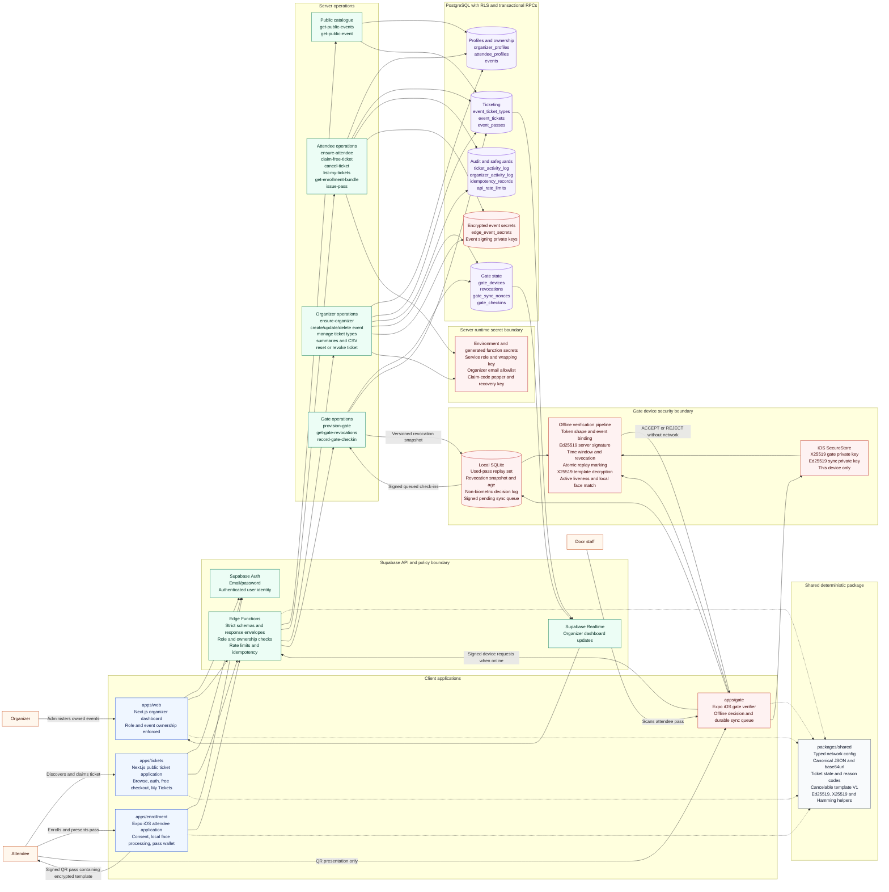
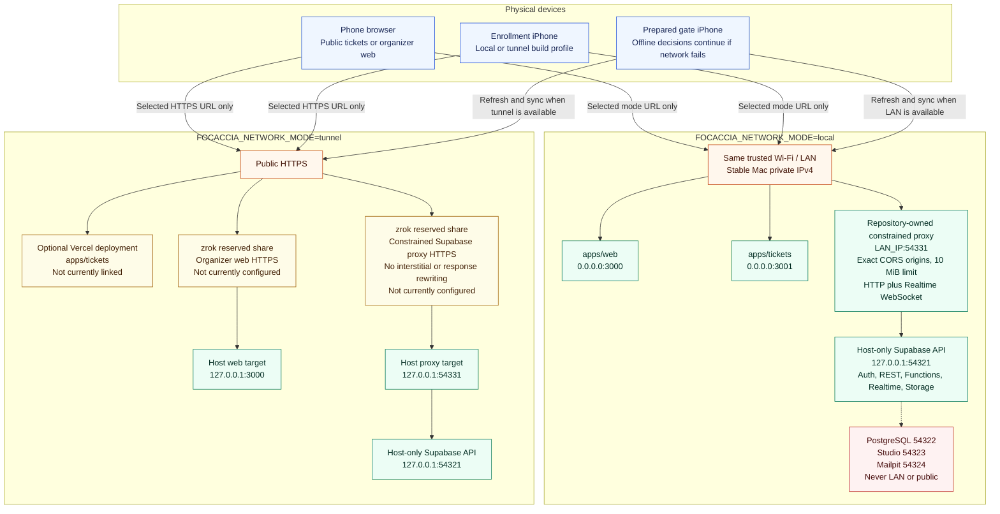
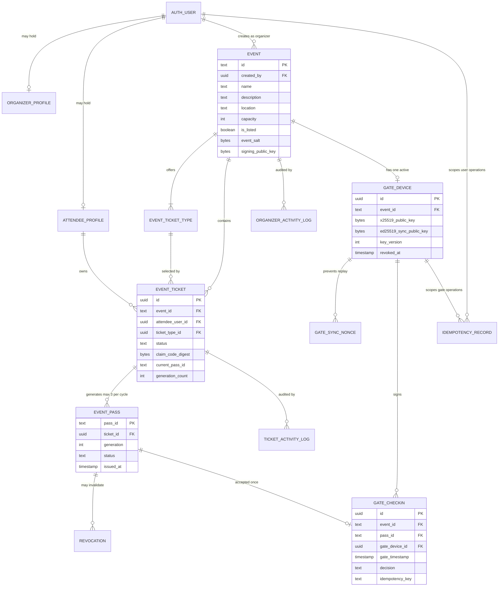
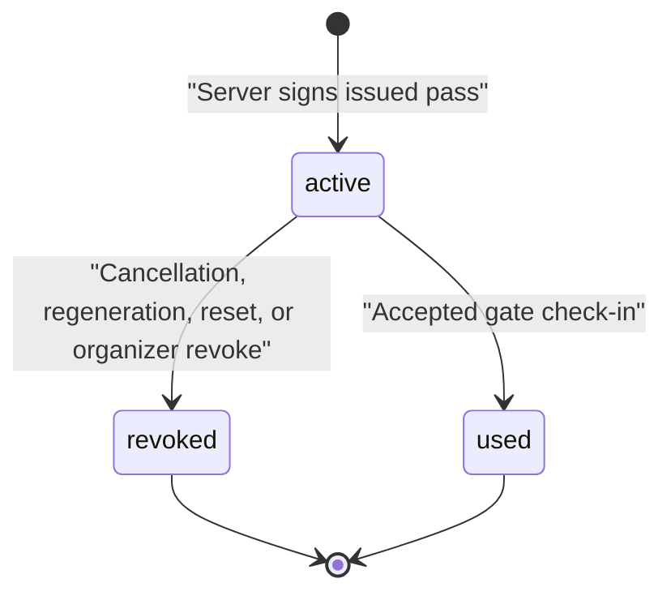
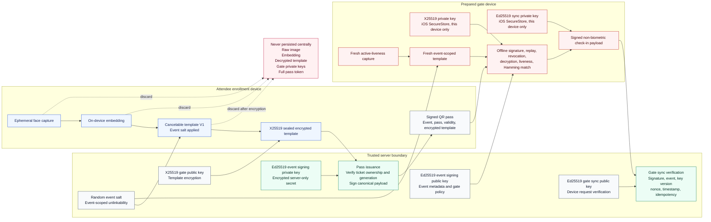
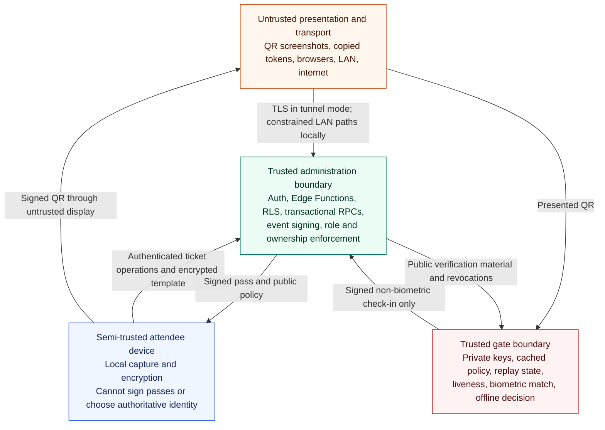
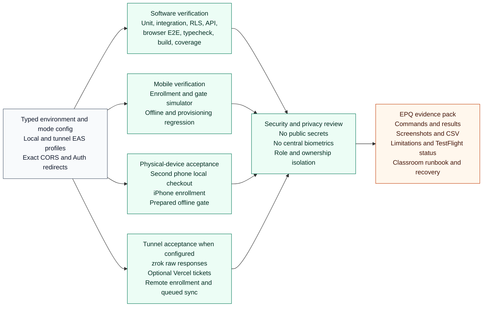

# Focaccia Updated Architecture Diagrams

## Scope

This document visualizes the implemented architecture in this repository. It covers the four user-facing
applications, shared code, Supabase services, local and tunnel deployment modes,
ticket and pass lifecycles, cryptographic trust boundaries, offline gate
verification, signed synchronization, privacy constraints, and operational
verification.

The code paths shown are implemented. Local browser/network and simulator paths
are verified. zrok, Vercel, EAS project linkage, TestFlight, and audience-owned
iPhone distribution are not currently configured and are not deployment claims.

## 1. End-To-End System Architecture



### Architectural invariants

- The organizer dashboard, public ticket site, enrollment app, and gate app are
  separate applications with separate roles and responsibilities.
- Authentication does not grant organizer authority. `ensure-organizer` checks
  the server-only allowlist, and every organizer mutation checks event ownership.
- Ticket checkout and pass issuance require an authenticated attendee and
  server-derived ownership. A claim code never transfers ownership.
- The database serializes final-seat checkout and enforces four active tickets
  per attendee per event, ticket capacities, legal state transitions, and a
  maximum of three pass generations per reset cycle.
- Raw face images, embeddings, decrypted templates, and reusable biometrics do
  not enter Supabase, browser applications, logs, check-in payloads, or the sync
  queue.
- The gate makes the complete entry decision offline. Connectivity is used only
  to refresh revocations and synchronize already-completed decisions.

## 2. Local And Tunnel Deployment Topology



### Network contract

- Clients select exactly one typed mode. They do not infer, rewrite, or silently
  fall back between hosts.
- Public bundles contain only the selected URLs and Supabase anon key. Service
  role credentials, signing secrets, organizer allowlists, claim-code secrets,
  and gate private keys remain outside public bundles.
- Local acceptance requires a second physical device and all tunnels stopped.
- Tunnel acceptance requires exact HTTPS origins, zrok raw-response checks,
  and matching Auth redirect and CORS lists. The ticket application may use its
  zrok share or a separately configured Vercel deployment.
- A tunnel or LAN outage can delay enrollment, revocation refresh, and check-in
  synchronization, but cannot invalidate an already-provisioned gate's offline
  verification capability.

## 3. Identity, Ticket, Pass, And Check-In Data Model



### Lifecycle constraints

```mermaid
stateDiagram-v2
  [*] --> claimed: "Free checkout"
  claimed --> enrolled: "Initial pass generation"
  enrolled --> enrolled: "Regenerate; revoke old pass"
  enrolled --> checked_in: "Valid signed gate ACCEPT sync"
  enrolled --> claimed: "Organizer reset; revoke pass; reset generation cycle"
  claimed --> cancelled: "Attendee cancellation"
  enrolled --> cancelled: "Attendee cancellation and pass revocation"
  claimed --> revoked: "Organizer revocation"
  enrolled --> revoked: "Organizer revocation and pass revocation"
  checked_in --> [*]
  cancelled --> [*]
  revoked --> [*]
```





## 4. Cryptographic And Privacy Architecture



### Key separation

| Security purpose | Key | Private-key location | Public material |
|---|---|---|---|
| Pass authenticity | Event Ed25519 keypair | Encrypted server-only secret | Gate policy and event metadata |
| Biometric-template confidentiality | Gate X25519 keypair | Gate iOS SecureStore | Backend and enrollment bundle |
| Gate sync authenticity | Gate Ed25519 keypair | Gate iOS SecureStore | `gate_devices` |
| Cross-event unlinkability | Random event salt | Not secret; event-scoped | Enrollment and gate policy |
| Claim-code lookup protection | Server HMAC pepper and recovery key | Server environment only | No public key material |

## 5. Ticket Purchase, Enrollment, And Pass Issuance

```mermaid
sequenceDiagram
  autonumber
  actor A as Attendee
  participant T as Public ticket app
  participant Auth as Supabase Auth
  participant API as Edge Functions
  participant DB as PostgreSQL and RLS
  participant E as Enrollment iOS app
  participant Local as On-device biometric pipeline

  A->>T: Browse listed future events
  T->>API: get-public-events / get-public-event
  API->>DB: Read listed catalogue and advisory capacity
  DB-->>API: Event and active ticket types
  API-->>T: Public event envelope

  A->>T: Sign up or sign in
  T->>Auth: Email/password authentication
  Auth-->>T: User session
  T->>API: ensure-attendee with full name
  API->>DB: Upsert profile using Auth-derived identity and email

  A->>T: Claim free ticket
  T->>API: claim-free-ticket plus UUID idempotency key
  API->>DB: Lock event then ticket type; enforce capacity and uniqueness
  DB-->>API: Claimed ticket and protected claim-code result
  API-->>T: Ticket confirmation and enrollment next step

  A->>E: Sign in with the same account
  E->>Auth: Restore authenticated attendee session
  E->>API: list-my-tickets or owned claim-code lookup
  API->>DB: Verify attendee ownership
  E->>API: get-enrollment-bundle for owned ticket
  API->>DB: Load event public keys, salt, policy, ticket state
  API-->>E: Ticket-bound enrollment bundle

  A->>E: Consent and face capture
  E->>Local: Create embedding and event-scoped cancelable template
  Local->>Local: Encrypt template to gate X25519 public key
  E->>API: issue-pass plus canonical payload and idempotency key
  API->>DB: Verify ownership, state, generation limit, and event binding
  API->>DB: Revoke previous generation when regenerating
  API-->>E: Event Ed25519 signature and pass metadata
  E->>E: Assemble and securely store signed QR pass
  E-->>A: Display generation and remaining allowance
```

## 6. Offline Verification And Signed Deferred Sync

```mermaid
sequenceDiagram
  autonumber
  actor Staff as Door staff
  actor Person as Attendee
  participant Gate as Gate iOS app
  participant Secure as SecureStore
  participant SQLite as Local SQLite
  participant API as Gate Edge Functions
  participant DB as PostgreSQL
  participant Web as Organizer dashboard

  Note over Gate,SQLite: Before doors open while online
  Gate->>Secure: Load X25519 and Ed25519 private keys
  Gate->>API: Signed get-gate-revocations request
  API->>DB: Verify gate key and return versioned snapshot
  API-->>Gate: Revocations, server time, key version
  Gate->>SQLite: Replace cached snapshot and record refresh time
  Gate-->>Staff: Ready only after first snapshot; fresh at 5 minutes or less

  Note over Person,SQLite: Entry decision with networking disabled
  Person->>Gate: Present signed QR pass
  Gate->>Gate: Validate token shape, event, time, and server signature
  Gate->>SQLite: Check cached revocation and used-pass set
  Gate->>Secure: Decrypt template with gate X25519 private key
  Gate->>Person: Perform active liveness and fresh capture
  Gate->>Gate: Create event-scoped live template and compare locally

  alt Valid and matching pass
    Gate->>Secure: Sign canonical check-in payload with sync key
    Gate->>SQLite: Atomic transaction: mark used, log ACCEPT, enqueue signed item
    Gate-->>Staff: ACCEPT
  else Invalid, replayed, revoked, expired, or non-matching
    Gate->>SQLite: Store non-biometric REJECT reason where permitted
    Gate-->>Staff: REJECT with plain-English reason
  end

  Note over Gate,Web: Later when selected network mode is reachable
  loop Durable bounded retry with backoff and jitter
    Gate->>SQLite: Load pending signed check-in
    Gate->>API: record-gate-checkin with original gate time, nonce, idempotency key, signature
    API->>DB: Verify key, signature, event, timestamp, nonce, pass, and state
    DB->>DB: Idempotently create check-in; mark pass used and ticket checked_in
    API-->>Gate: Receipt; duplicate identical receipt is success
    Gate->>SQLite: Mark queue item synchronized
  end
  DB-->>Web: Realtime check-in and summary update
```

### Offline consistency boundary

- The used-pass marker, ACCEPT log, and signed queue item commit atomically before
  the gate displays acceptance.
- Synchronization failure never reverses an offline acceptance.
- A disconnected gate cannot know about a later server-side cancellation or
  revocation. The cached snapshot remains authoritative until the next refresh.
- Cache state is `fresh` through five minutes, `stale` after five minutes, and
  `critical` after thirty minutes or when no snapshot exists. The first snapshot
  is mandatory before scanning; later staleness warns without disabling a
  prepared offline gate.

## 7. Authorization And Trust Boundaries



| Boundary | Enforcement |
|---|---|
| Public catalogue | Listed, non-deleted events and active ticket types only |
| Attendee API | Supabase user session, server-derived identity, ticket ownership, strict validation |
| Organizer API | User session, server-only allowlist grant, organizer profile, event ownership |
| Database | RLS, constraints, legal transition triggers, row locks, security-definer RPCs |
| Gate provisioning | Owning organizer plus one active gate per event |
| Revocation refresh | Signed gate device request, key version and event binding |
| Check-in sync | Canonical Ed25519 signature, nonce replay defense, timestamp, idempotency, server-side pass resolution |
| Offline QR | Event Ed25519 signature, time, event binding, cached revocation, atomic replay check, liveness and face match |

## 8. Operations, Verification, And Evidence Architecture



Final acceptance must separately prove local mode with all tunnels stopped,
tunnel mode through zrok and optional Vercel ticket hosting, offline gate behavior with networking
disabled, signed queued synchronization after connectivity returns, role
isolation, capacity-race handling, revocation and reset behavior, and truthful
Apple/TestFlight distribution status.
